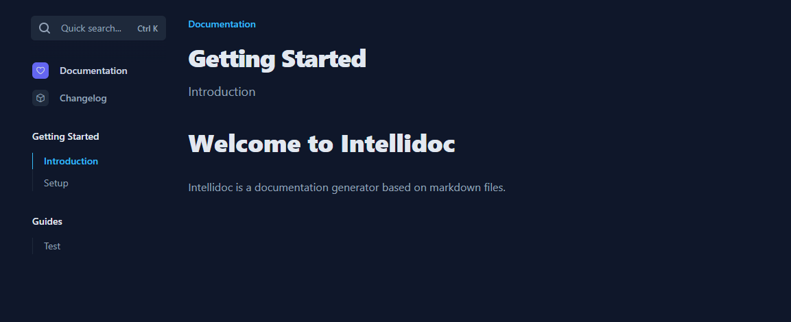

# Intellidoc

Generate beautiful documentation only writing markdown files.



## Getting Started

**Clone the project**
`git clone git@github.com:tom-brulin/Intellidoc.git`

**Install dependencies**
`npm install`

**Run server**

> Development
> `npm run dev`

> Production
> `npm run build`
> `npm run start`

## Write documentation

Every documentation should be writed under the docs folder.

We have 3 levels of documentation : **Category**, **Sub Category** and **Page**.

Every directories and files name will be part of url, we advice you to don't use spaces.

### Category

This is the top level of our documentation.
A category is represented by a directory under the docs folder.

In a category folder you can have a index.md file that will contain metadata about the current category. Metadata file is not required.

**Metadata file example**
```
---
name: Documentation
icon: Heart (name of icon on https://phosphoricons.com/)
index: 1 (order in sidebar)
---
```

### Sub Category

This is the middle level of our documentation.
A sub category is represented by a directory under a category folder.

In a sub category folder you can have a index.md file that will contain metadata about the current sub category. Metadata file is not required.

**Metadata file example**
```
---
name: Documentation
index: 1 (order in sidebar)
---
```

### Page

This is the last level of our documentation.
A page is represented by a markdown file under a sub category.

In a page file you can have metadata at the top of the file. Metadata is not required.

**Metadata file example**
```
---
name: Documentation
index: 1 (order in sidebar)
---
```

## Features Roadmap

- Search
- Customizable Navbar
- Customizable Footer
- Code Syntax Highlighting
- Notes
- Code Group (with tabs)